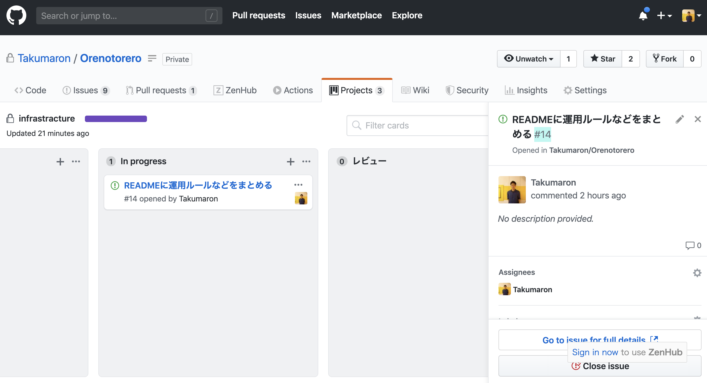
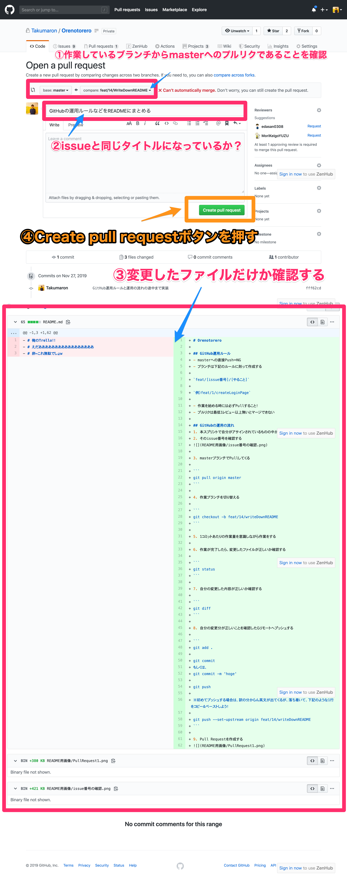
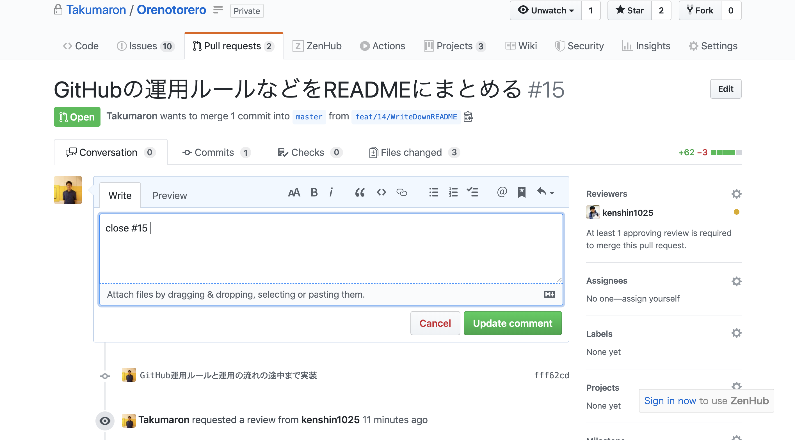
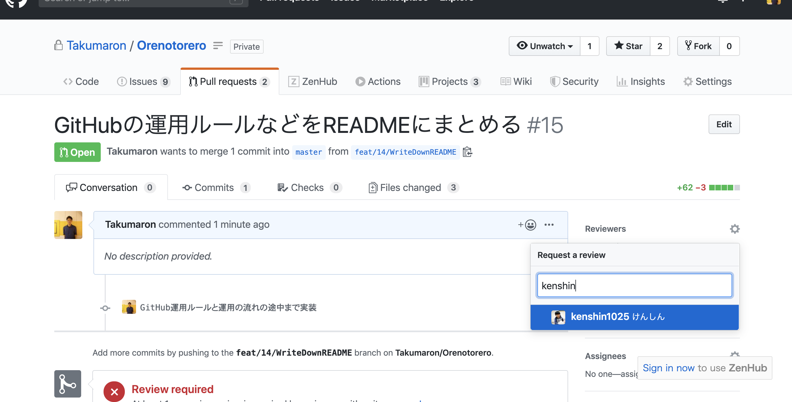

# Orenotorero

## 開発用アプリケーションの立ち上げ方

※全て別ウィンドウで実行のこと

``` bash
# 開発用DBを立ち上げる（立ち上がるのに20秒ほどかかります）
make dev-db
# -> root
# -> orenotorero
# と2回連続rootと入力する

# クライアントサイドアプリケーションを立ち上げる
cd client && yarn
yarn dev

# サーバサイドアプリケーションを立ち上げる
cd server/API_server/src
go run main.go wire_gen.go

```

## APIドキュメントの確認方法
1. [Swagger](https://editor.swagger.io/)へアクセスする
2. [Swaggerの内容](https://github.com/Takumaron/Orenotorero/blob/master/swagger.yml)をSwaggerページにコピペする

## GitHub運用ルール
- masterへの直接Push＝NG
- ブランチは下記のルールに則って作成する

`feat/[issue番号]/[やること]`

`例）feat/1/createLoginPage`

- 作業を始める時には必ずPullすること！
- プルリクは最低1レビュー以上無いとマージできない

## GitHubの運用の流れ
### 1. 本スプリントで自分がアサインされているものの中から今から作業するissueを決める

### 2. そのissue番号を確認し、カードをIn progressへ移動しておく



### 3. masterブランチでPullしてくる

```
git pull origin master
```

### 4. 作業ブランチを切り替える

```
git checkout -b feat/14/writeDownREADME
```

### 5. 1コミットあたりの作業量を意識しながら作業をする

### 6. 作業が完了したら、変更したファイルが正しいか確認する

```
git status
```

### 7. 自分の変更した内容が正しいか確認する

```
git diff
```

### 8. 自分の変更分が正しいことを確認したらリモートへプッシュする

```
git add .

git commit
もしくは、
git commit -m 'hoge'

git push

※初めてプッシュする場合は、訳の分からん英文が出てくるが、落ち着いて、下記のような1行をコピー＆ペーストしよう！

git push --set-upstream origin feat/14/writeDownREADME
```

### 9. Pull Requestを作成する




### 10. descriptionに `close #[issue番号]` と入力

これをやっておくことで、マージされたタイミングに自動でissueがcloseになるのでおすすめ！



### 11. レビューしてもらいたい人をアサインする



### 12. ProjectsのカードをIn progressからレビューへ変更する

### 13. アサインしたレビュワーに対してレビュー依頼を送る（Slackの#reviewチャンネルで！）

▼定型文

```
@けんしん
お疲れ様です。
下記プルリクのレビュー＆マージをお願いします。

https://github.com/Takumaron/Orenotorero/pull/15
```
